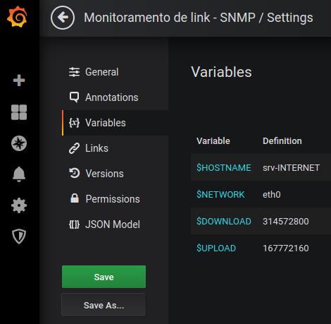

# monitoramento-link-internet-snmp
Mede o consumo real do tráfego de internet por SNMP

 

Instalação:

1- No servidor de internet.

    # bash <( curl -Ss https://raw.githubusercontent.com/joserf/monitoramento-link-internet-snmp/master/install.sh)

2- No servidor Docker, crie as pastas necessárias.

    $ sudo mkdir -p /home/joserf/docker/containers/grafana/data
    $ sudo chown -R 472:472 /home/joserf/docker/containers/grafana
    $ sudo chmod -R 775 /home/joserf/docker/containers/grafana
    $ sudo sudo mkdir -p /home/joserf/docker/containers/influxDB/data
    $ sudo mkdir -p /home/joserf/docker/containers/telegraf/data
    
 Criando o arquivo telegraf.conf.   
    
    # docker run --rm telegraf --input-filter ping -sample-config > /home/joserf/docker/containers/telegraf/data/telegraf.conf
    
 Adicione o ip do servidor Docker.
 
    # sed -i '113i\  urls = ["http://192.168.0.171:8086"]' /home/joserf/docker/containers/telegraf/data/telegraf.conf
    
 Edite o arquivo telegraf.conf.
 
    $ sudo vim /home/joserf/docker/containers/telegraf/data/telegraf.conf
    
 telegraf.conf, Adicione no final do arquivo. 
 
    [[inputs.snmp]]
      # IP do servidor de internet. 
      agents = [ "192.168.0.123:161"]
      version = 2
      community = "public"
      name = "snmp"

    [[inputs.snmp.field]]
      name = "hostname"
      oid = "RFC1213-MIB::sysName.0"
      is_tag = true

    [[inputs.snmp.table]]
      name = "snmp"
      inherit_tags = [ "hostname" ]
      oid = "IF-MIB::ifXTable"

    [[inputs.snmp.field]]
       name = "sysUpTimeInstance"
       oid = "1.3.6.1.2.1.1.3.0"

    [[inputs.snmp.table.field]]
      name = "ifName"
      oid = "IF-MIB::ifName"
      is_tag = true
      
3- Instalação e criação de containers.

    # docker-compose up -d

   http://192.168.0.171:3000/login
  
  Login: admin 
  Senha: secret
  
  Data Source
 
 
  
  Importe o template (Monitoramento de link - SNMP.json) ou 11509 (Grafana.com Dashboard), e edite as variáveis de acordo com sua configuração, em download e upload utilize o site: https://www.gbmb.org/mb-to-bytes com os valores reais de download e upload do link de internet.
  
  

      
